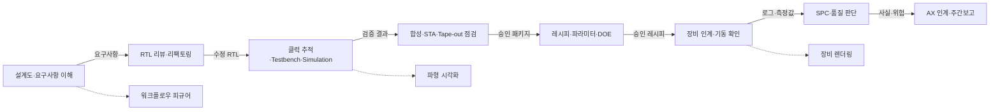

# 반도체 범용 스킬 더미 카탈로그 초안

## 1. 목표

이 문서는 SKALA MSA 프로젝트의 스킬 카탈로그와 스닉픽 데모에 사용할 더미 데이터 계획이다.

- 플랫폼의 핵심 메시지: **한 번 등록한 업무 스킬을 로컬·온라인 LLM 대상 형식으로 변환할 수 있다.**
- 데모의 핵심 메시지: **설계, 검증, EDA, 공정, 장비, 품질, AX가 하나의 제품 라이프사이클로 연결된다.**
- 사용자 역할의 범위: 스킬의 실제 실행 엔진이 아니라, 화면과 변환 테스트에 사용할 스킬 정보·가상 입력·가상 출력·제약 조건을 만든다.

구조화된 작성 원본은 [`src/data/skills.seed.json`](../src/data/skills.seed.json), 검증 규격은 [`src/data/skills.schema.json`](../src/data/skills.schema.json)에 둔다. 기존 백엔드에는 생성된 [`src/data/courses.api.seed.json`](../src/data/courses.api.seed.json) 또는 [`src/data/courses.sql.seed.sql`](../src/data/courses.sql.seed.sql)을 사용한다. DB 스키마와 Course API는 변경하지 않는다.

## 2. 공통 데모 시나리오

모든 스킬은 아래 가상 식별자를 공유한다. 같은 식별자를 반복 사용하면 서로 다른 카드의 입출력이 하나의 업무 흐름처럼 보인다.

| 구분 | 가상 값 |
|---|---|
| 제품 | `MEM-DEMO-A0` |
| RTL 버전 | `rtl-v0.3` |
| Lot | `LOT-DEMO-0903` |
| 장비 | `ETCH-DEMO-01` |

전체 연결 흐름은 다음과 같다.



## 3. 스킬 카탈로그 24종

### AX·지식 인계

| ID | 스킬 | 핵심 입출력 |
|---|---|---|
| 1 | 엔지니어링 인계 요약 | 팀 메모 → 완료·미결·담당자·다음 행동 |
| 2 | 설계도·장비 설명서 이해 도우미 | 문서 일부 → 구성·순서·경고·질문 |
| 3 | 반도체 개발 주간 리스크 보고서 | 여러 팀의 사실 → 성과·위험·의사결정 |

### 팹리스·RTL·EDA

| ID | 스킬 | 핵심 입출력 |
|---|---|---|
| 4 | SystemVerilog RTL 기본 리뷰 | RTL → 줄 단위 위험·수정 후보 |
| 5 | 기능 보존 HDL 리팩토링 | 기존 HDL·불변조건 → 리팩토링 코드·동치 확인 |
| 6 | RTL 클럭 단위 상태 추적 | 초기값·자극 → 에지별 상태 표 |
| 7 | 카르노맵 논리식 최적화 | minterm·don't-care → 그룹·최소식 |
| 8 | RTL 테스트벤치 시나리오 초안 | 인터페이스·요구사항 → 정상·경계·오류 시나리오 |
| 9 | EDA 단계·검증 경로 추천 | 문제 증상 → 우선 EDA 단계·필요 증거 |
| 10 | RTL 시뮬레이션 디버깅 가이드 | 로그·파형 관찰 → 증거·가설·다음 확인 |
| 11 | 합성 경고 우선순위 분류 | 합성 경고 → 기능 위험·확인 순서·waiver 상태 |
| 12 | 타이밍 클로저 분석 계획 | STA 위반 → 제약·경로·수정 후보·재검증 |
| 13 | Tape-out 준비도 점검 | signoff 상태 → 차단 항목·누락 증거·담당자 |

### 파운드리·공정·장비·품질

| ID | 스킬 | 핵심 입출력 |
|---|---|---|
| 14 | 공정 파라미터 승인 범위 점검 | 후보값·승인범위 → 범위 이탈·차단 상태 |
| 15 | 레시피 변경 영향 분석 | 변경 전후값 → 영향 제품·시험·승인·롤백 |
| 16 | 공정 DOE 계획 초안 | 요인·수준·반응변수 → 실험계획 초안 |
| 17 | SPC 이상 징후 분류 | 측정값·관리한계 → 이상 신호·가설·후속 확인 |
| 18 | 장비 인수인계 준비도 점검 | 문서·안전·교정 상태 → 인수 차단 항목 |
| 19 | 장비 기동 전 동작 확인 | SOP 체크 결과 → PASS·FAIL·PENDING·기동 판정 |
| 20 | 장비 알람 타임라인 분석 | 알람 로그·Lot → 최초 관찰·후속 알람·영향 범위 |

### 시각화·렌더링

| ID | 스킬 | 핵심 입출력 |
|---|---|---|
| 21 | RTL 파형 시각화 명세 | 신호·질문 → 표시 순서·시간창·주석 |
| 22 | 공정·품질 대시보드 명세 | 지표·차원·질문 → 패널·필터·기준선 |
| 23 | 반도체 장비 렌더링 브리프 | 장비 구성·교육 목표 → 카메라·라벨·색상·제외정보 |
| 24 | 설계-공정 워크플로우 피규어 | 단계·인계 산출물 → Mermaid 흐름도 |

## 4. 스닉픽 카드 표시 규칙

목록 카드에서는 정보 과밀을 피하기 위해 다음만 표시한다.

1. `name`
2. `domain`과 `lifecycleStage`
3. `shortDescription`
4. `skillType`, `riskLevel`, `compatibleTargets` 배지
5. `demoInput`에서 대표 값 한 줄
6. `demoOutput`에서 대표 결과 한 줄

상세 화면은 다음 탭으로 나누는 구성이 적합하다.

| 탭 | 데이터 |
|---|---|
| 개요 | 사용 조건, 단계, 유형, 위험도, 호환 대상 |
| 지침 | `instructions`, `requiredInputs`, `outputFields` |
| 스닉픽 | `demoInput`과 `demoOutput` 좌우 비교 |
| 검증 | `successCriteria`, `limitations` |
| 연결 스킬 | `relatedSkills` |

## 5. 데이터 유형을 섞은 이유

24개를 모두 일반 프롬프트로 만들면 모델별 변환 데모가 단조로워진다. 아래 여섯 유형을 섞어 변환기가 다양한 계약을 처리하는 모습을 보여준다.

| 유형 | 예시 |
|---|---|
| `PROMPT` | 주간 리스크 보고서 |
| `STRUCTURED` | 클럭 추적, 파라미터 범위 점검 |
| `CHECKLIST` | Tape-out, 장비 인계, 기동 확인 |
| `CODE_TRANSFORM` | HDL 리팩토링 |
| `DIAGNOSTIC` | Simulation·EDA·SPC·알람 분석 |
| `VISUAL_SPEC` | 파형·대시보드·장비 렌더링·워크플로우 |

## 6. 안전·정확성 경계

본 데이터는 시연용이므로 다음 원칙을 모든 스킬에 적용한다.

- 코드, 측정값, 공정 범위, Lot, 장비, 문서는 전부 가상 데이터다.
- EDA 스킬은 분석 계획과 더미 결과만 만들며 실제 도구를 실행하지 않는다.
- 파라미터 스킬은 제공된 승인 범위를 검사할 뿐 최적값을 임의 생성하지 않는다.
- 장비 스킬은 제어 명령, 인터록 우회, 알람 해제, 생산 투입 명령을 만들지 않는다.
- `PASS`, `READY`, `APPROVED`는 입력에 증거가 있을 때만 사용한다.
- 시각화 스킬은 그림·CAD·3D 모델이 아니라 제작 명세와 Mermaid 초안을 반환한다.
- 실제 생산·품질·안전 결정에는 담당 엔지니어 승인이 필요하다.
- `compatibleTargets`는 데모에서 보여줄 변환 대상 후보이며 실제 provider 실행 검증 완료를 의미하지 않는다.

## 7. 기존 백엔드 호환 방식

Course 등록 API는 `title`, `description`, `category`, `price`만 받는다. 스킬 전용 컬럼을 추가하지 않고 다음과 같이 매핑한다.

| 스킬 데이터 | 기존 백엔드 필드 |
|---|---|
| `name` | `courses.title` |
| 전체 스킬 메타데이터와 데모 입출력 | `courses.description`의 `SKILL_DESCRIPTION_V1` JSON 문자열 |
| `category` | `courses.category` 기존 enum |
| 고정값 `0` | `courses.price` |
| `usageCount` | SQL seed의 `courses.enrollment_count` |
| 작성자 데모 계정 `4` | SQL seed의 `courses.instructor_id` |

`courses.api.seed.json`의 각 원소는 `POST /api/courses`에 그대로 보낼 수 있다. SQL 초기화가 필요하면 같은 데이터가 담긴 `courses.sql.seed.sql`을 기존 `init-db`에 추가한다.

팀원 자산 등록 화면의 추가 입력도 같은 JSON 안에 보존한다.

| 등록 화면 필드 | `description` JSON 필드 |
|---|---|
| 자산 유형 | `assetType` |
| 등급 | `grade` |
| 설치 명령 | `installCommand` |
| 본문 | `body`, 카드용 요약은 `shortDescription` |

24개 더미 스킬은 모두 가상·미검증 데이터이므로 `grade=EXPERIMENTAL`, `installCommand=""`로 생성한다. `skillType`은 화면의 기존 자산 유형에 맞게 `CODE`, `DOCUMENT`, `TEMPLATE`, `ETC` 중 하나로 변환하지만 원래 값도 함께 보존한다.

`description`은 백엔드에서 일반 문자열로 저장·반환한다. 이 작업은 데이터 생성까지만 담당하며 프런트·백엔드 구현은 변경하지 않는다. 화면에서 상세 메타데이터가 필요할 경우 소비 측에서 `format === "SKILL_DESCRIPTION_V1"`인 문자열만 JSON으로 해석하고, 그 외 설명은 기존 문자열로 처리한다.

```json
{
  "format": "SKILL_DESCRIPTION_V1",
  "assetType": "TEMPLATE",
  "grade": "EXPERIMENTAL",
  "shortDescription": "카드에 표시할 요약",
  "demoInput": {},
  "demoOutput": {}
}
```

원본을 수정한 뒤 아래 명령으로 두 호환 seed를 다시 만든다.

```bash
npm run seed:build
npm run seed:check
```

## 8. 구현 순서

사용자에게 할당된 더미 데이터 작업은 아래 범위까지 완료하면 독립 산출물로 인정할 수 있다.

1. `skills.seed.json`에 24종 스킬 정보와 데모 입출력 작성
2. slug·ID·연결 스킬·필수 데모 입력 검증
3. `seed:build`로 기존 Course API와 `courses` 테이블 형식 생성
4. 프런트에서 `description`의 `SKILL_DESCRIPTION_V1`을 파싱해 스닉픽 표시

실제 provider별 스킬 변환, EDA 실행, 장비 연결, 이미지 렌더링은 이 더미 데이터 작업의 범위 밖이다.
